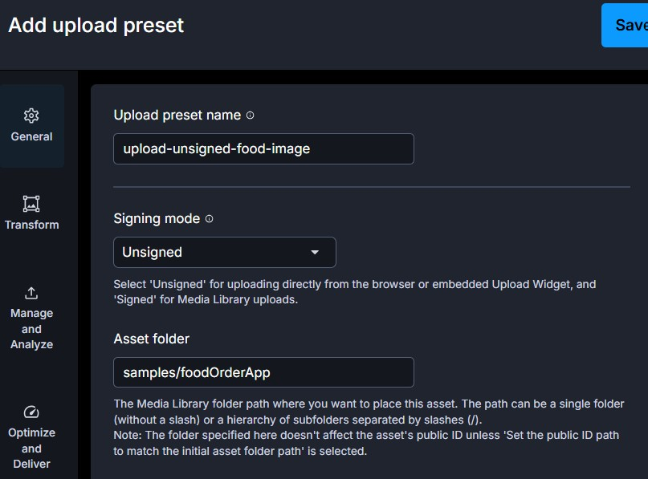

# Food Order App

## Overview

A food ordering application featuring two user roles: **Customer** and **Admin**. Built with React, Context API, [Material UI](https://mui.com/), [Cloudinary](https://cloudinary.com/), localStorage, and json-server.

## Features

For **Admin**:
- Add, edit, and delete food items
- View detailed food information
- Compress and upload food images to Cloudinary
- Reuse previously uploaded images
- View all customer orders
- Update order status: Prepare, Reject, or Completed

For **Customer**:
- Browse available food items
- View food details
- Add or remove food items from cart
- View cart, checkout orders
- View order history

## Running the Demo

This project includes:
- Frontend: `food-order-app/`
- Backend (mock API): `server-api/`

### Backend Setup

1. Copy the example database:

    ```bash
    cp server-api/db.example.json server-api/db.json
    ```
2. Install dependencies and start the server:

    ```bash
    cd server-api
    npm install
    npm start
    ```

> The backend runs on [http://localhost:3006](http://localhost:3006) by default.

### Cloudinary Setup

This app uploads food images programmatically without a signature using the [Cloudinary Unsigned Upload API](https://cloudinary.com/documentation/upload_images#unsigned_upload).

> Cloudinary REST API URL: https://api.cloudinary.com/v1_1/<your_cloud_name>/<resource_type>/upload

1. [Sign up for a free Cloudinary account](https://cloudinary.com/users/register_free) to get your cloud name.
2. In the Cloudinary console, create an Upload Preset named as `upload-unsigned-food-image`. Set the signing mode to Unsigned.
   
    
   
3. Create an `.env` file in the `food-order-app/` root directory.
4. Add your Cloudinary REST API URL in .env as REACT_APP_API_URL:
   
    ```bash
    REACT_APP_API_URL=https://api.cloudinary.com/v1_1/<your cloud name>/image/upload
    ```
    
5. Add your Cloudinary image URL prefix in .env as REACT_APP_PREFIX_IMAGEURL:
   
    ```bash
    REACT_APP_PREFIX_IMAGEURL=https://res.cloudinary.com/<your cloud name>/image/upload/
    ```
    
### Frontend Setup

1. Install dependencies and start the frontend:

    ```bash
    cd food-order-app
    npm install
    npm start
    ```

> The app runs on [http://localhost:3000](http://localhost:3000) by default.

## Project Screenshots


